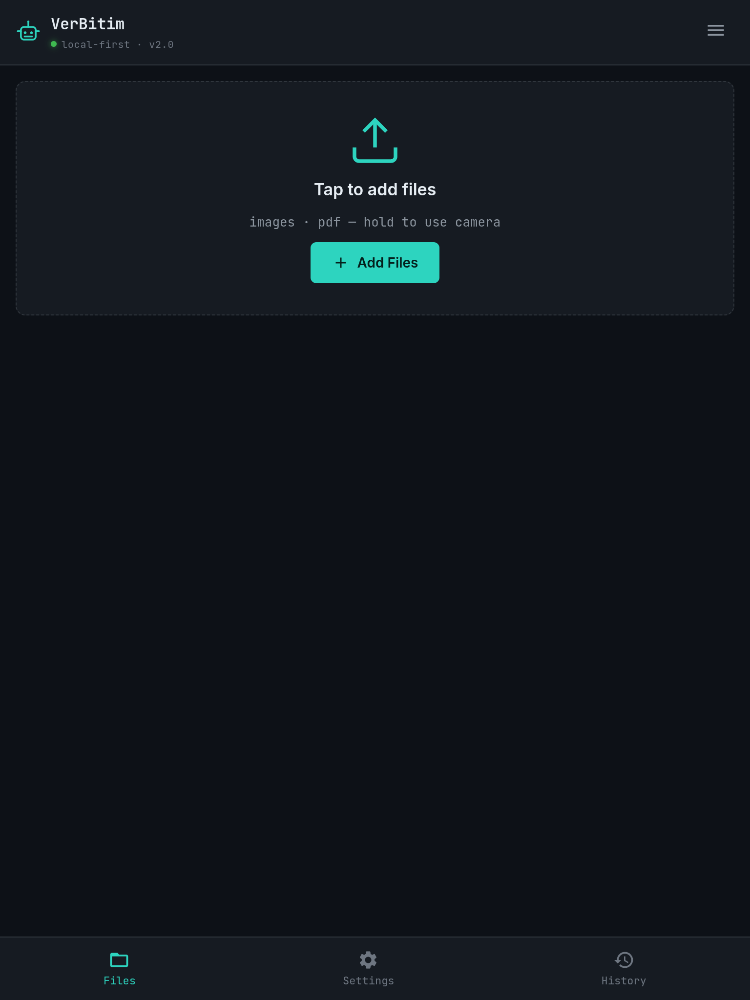

# PDF Creator Pro

[](https://github.com/detnexep/verbitim/actions)

A mobile-first tool that turns images and existing PDFs into a single PDF. Runs entirely in the browser — no server, no account, no upload.

**Live:** https://detnexep.github.io/verbitim/



## What it does

- Merges JPEG, PNG, WebP, HEIC, SVG, BMP, GIF, and existing PDF files into one PDF, in whatever order you set
- Embeds JPEG/PNG bytes directly when possible — zero recompression
- Reads EXIF orientation, so photos taken in portrait come out upright instead of sideways
- Optional page numbers, watermark text, and custom page size / margin / orientation
- Installable as a PWA; works offline once loaded
- All processing happens on-device — files never leave your phone

## What it doesn't do yet

- No OCR — text inside an image isn't searchable or selectable
- No editing of pages inside an existing PDF (only whole-document merging)
- No password protection or encryption
- No auto perspective correction for photographed documents (crooked photos stay crooked)

## Stack

Plain HTML/CSS/JS. No framework, no build step, no bundler.

- [pdf-lib](https://pdf-lib.js.org/) — PDF construction
- [heic2any](https://github.com/alexcorvi/heic2any) — HEIC → JPEG conversion
- A service worker for offline caching (network-first, cache as fallback)

## Structure

```
index.html
manifest.json
sw.js
css/
  style.css
js/
  app.js              UI, file list, drag & drop, menu drawer
  pdf-engine.js        PDF construction, EXIF handling, page layout
  file-handler.js      file validation helpers
  image-processor.js   image decoding / rotation utilities
icons/
```

## Running locally

No build step — any static file server works.

```
git clone https://github.com/detnexep/verbitim.git
cd verbitim
python3 -m http.server 8000
```

Open `http://localhost:8000`.

## Deploying

Static hosting only. On GitHub Pages specifically: files must sit at the repo root (or `/docs`), and a `.nojekyll` file must be present at the root, or the default Jekyll build step will fail before your files are ever served.

## License

No license file yet — until one is added, default copyright applies and reuse isn't legally permitted. [Add a LICENSE file](https://choosealicense.com/) (MIT is the common choice for a small personal tool like this) if you want it actually open.
